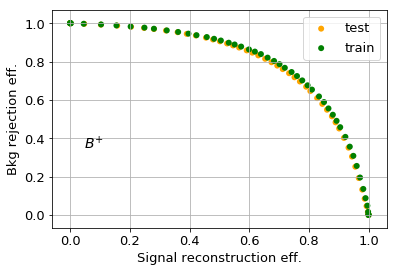
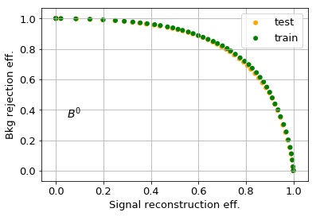

### Semileptonic decay classification

This is work I carried out together at the univerity of Karlsruhe and later was used in two publications [ref1] and [ref2].
The aim of the work was to use machine learning to classify semileptonic decays of $B$ mesons into two categories those 
involving a decay to a hadron containing a $u$ quark $B \rightarrow X_{u} \ell \nu$ and those with a decay to a hadron containing a $c$ quark $B \rightarrow X_{c} \ell \nu$. The motivation for this is to remove background from the dominate process $B \rightarrow X_{c} \ell \nu$ in order to obtain a clean sample of $B \rightarrow X_{u} \ell \nu$, which is around 100 times rarer. 

I wrote a set of wrapper classes for xgboost, contained in this repo, and trained two BDTs to classify $B \rightarrow X_{u} \ell \nu$ vs $B \rightarrow X_{c} \ell \nu$ decays for the case
of $B=B^{+}$ (charged $B$ mesons) or $B^{0}$ (neutral $B$ mesons).

The ROC of the BDTs are shown below, where signal is $B \rightarrow X_{u} \ell \nu$ and background $B \rightarrow X_{c} \ell \nu$.

Further details can be found in the publication [Ref]. The figure below shows a key figure from the publication concerning the boosted decision tree classifier output. 
